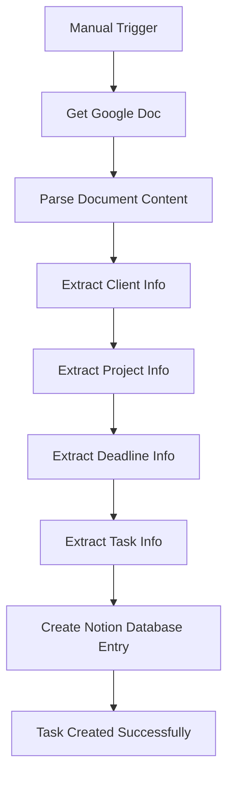

# Business Data Integration Automation

An intelligent data integration workflow that automatically extracts structured information from Google Docs and creates organized database entries in Notion, streamlining project management and client task tracking.

## 🎯 Overview

This n8n workflow automates the process of extracting client project information from Google Docs and transforming it into structured database entries in Notion. It's designed to eliminate manual data entry and ensure consistent project tracking across your business systems.

## ✨ Key Features

- **📄 Google Docs Integration**: Automatically retrieves content from specified Google Docs
- **🔍 Smart Data Parsing**: Extracts client, project, deadline, and task information from structured text
- **📊 Notion Database Integration**: Creates organized database entries with proper field mapping
- **⚡ Manual Trigger**: On-demand execution for processing specific documents
- **🔄 Batch Processing**: Handles multiple data blocks from a single document
- **📋 Structured Output**: Converts unstructured text into organized database records

## 🏗️ Workflow Architecture



## 🚀 Getting Started

### Prerequisites

- **n8n Instance**: Self-hosted or n8n Cloud account
- **Google Docs Access**: OAuth2 credentials for document access
- **Notion Account**: API access for database operations
- **Structured Document Format**: Google Doc with specific formatting

### Required Credentials

1. **Google Docs OAuth2 API**
   - Enable Google Docs API
   - Create OAuth2 credentials
   - Grant document access permissions

2. **Notion API**
   - Create Notion integration
   - Generate internal integration token
   - Grant access to specific databases

### Document Format Requirements

Your Google Doc should follow this structure:

```
Client: [Client Name]
Project: [Project Name]
Deadline: [Due Date]
Task: [Task Description]

[Additional blocks with same format...]
```

## 📋 Setup Instructions

### Step 1: Import Workflow

1. Copy the `Business Data Integration.json` file
2. Import into your n8n instance
3. Activate the workflow

### Step 2: Configure Google Docs

1. **Update Document URL**:
   - Replace the document URL in the "Get a document" node
   - Ensure the document is accessible with your Google account

2. **Document Structure**:
   - Format your document with the required structure
   - Use double line breaks to separate different client entries

### Step 3: Setup Notion Database

Create a Notion database with the following properties:

| Property Name | Type | Description |
|---------------|------|-------------|
| `Client` | Rich text | Client name |
| `Project` | Multi-select | Project name |
| `Deadline` | Date | Task deadline |
| `Task` | Title | Task description (used as page title) |

### Step 4: Configure Notion Integration

1. **Update Database ID**:
   - Replace the database ID in the "Create a database page" node
   - Ensure your Notion integration has access to the database

2. **Test Connection**:
   - Verify Notion API credentials
   - Test database access permissions

### Step 5: Test the Workflow

1. Execute the workflow manually
2. Verify data extraction from Google Doc
3. Check Notion database entry creation
4. Validate field mapping accuracy

## 🔧 Configuration Details

### Google Docs Node Settings

- **Operation**: Get document
- **Document URL**: Your Google Doc URL
- **Authentication**: Google Docs OAuth2

### Data Extraction Logic

The workflow uses JavaScript code to:

1. **Split Content**: Separates document into blocks by double line breaks
2. **Extract Fields**: Parses each block for structured information
3. **Clean Data**: Removes labels and trims whitespace
4. **Map Fields**: Assigns extracted data to specific variables

### Notion Database Mapping

| Source Field | Notion Property | Type |
|--------------|-----------------|------|
| `client` | Client | Rich text |
| `project` | Project | Multi-select |
| `deadline` | Deadline | Date |
| `task` | Title | Title |

## 📊 Output Format

### Notion Database Entry

Each execution creates a new database page with:

```json
{
  "title": "Task Description",
  "properties": {
    "Client": "Client Name",
    "Project": "Project Name",
    "Deadline": "2024-01-15"
  }
}
```

### Processing Results

- **Success**: New Notion page created with extracted data
- **Error Handling**: Failed entries logged for review
- **Batch Processing**: Multiple entries from single document

## 🛠️ Customization Options

### Modify Data Extraction

1. **Update Field Parsing**: Edit the "Edit Fields" node assignments
2. **Add New Fields**: Extend the extraction logic for additional data
3. **Change Format**: Modify the document structure requirements

### Notion Database Schema

1. **Add Properties**: Extend the Notion database with new fields
2. **Change Field Types**: Modify property types in Notion
3. **Update Mapping**: Adjust field mapping in the workflow

### Document Format

1. **Custom Structure**: Modify the parsing logic for different formats
2. **Multiple Formats**: Add conditional logic for various document types
3. **Validation**: Implement data validation before Notion creation

## 🔍 Troubleshooting

### Common Issues

**Google Docs Access Denied**
- Verify OAuth2 credentials
- Check document sharing permissions
- Ensure document URL is correct

**Notion Database Connection Failed**
- Verify Notion integration token
- Check database ID and permissions
- Ensure database properties match workflow mapping

**Data Extraction Errors**
- Verify document format matches expected structure
- Check for special characters in field labels
- Review JavaScript parsing logic

**Field Mapping Issues**
- Ensure Notion property names match exactly
- Verify property types are correct
- Check for typos in field assignments

### Debug Mode

Enable debug mode in n8n to:
- View extracted data at each step
- Identify parsing issues
- Monitor API responses

## 📈 Performance Optimization

### Best Practices

1. **Document Structure**: Maintain consistent formatting
2. **Batch Processing**: Process multiple entries efficiently
3. **Error Handling**: Implement retry logic for failed operations
4. **Monitoring**: Set up alerts for workflow failures

### Scaling Considerations

- **Large Documents**: Consider pagination for very large documents
- **Multiple Documents**: Duplicate workflow for different document types
- **Scheduled Execution**: Add triggers for automatic processing

## 🔒 Security Considerations

- **API Keys**: Store credentials securely in n8n
- **Document Access**: Limit Google Docs permissions to necessary documents
- **Notion Permissions**: Use specific database access, not full workspace access
- **Data Privacy**: Ensure compliance with data protection regulations

## 📚 Use Cases

### Project Management
- Convert meeting notes into actionable tasks
- Track client deliverables and deadlines
- Maintain project status updates

### Client Onboarding
- Process client information from intake forms
- Create structured client profiles
- Set up project tracking systems

### Task Management
- Convert email requests into tracked tasks
- Process work orders and assignments
- Maintain team task visibility

## 🔗 Related Workflows

- **Invoice Processor**: Document processing and data extraction
- **AI Customer Support**: Email processing and task creation
- **Plumbing Voice Agent**: Voice-to-task automation

## 🤝 Support

For issues or questions:
1. Check the troubleshooting section
2. Review n8n community forums
3. Verify Google Docs and Notion API documentation
4. Contact the workflow creator

## 📝 License

This workflow is part of the AI Automation Templates collection and is available under the MIT License.

---

*Last updated: January 2025*
