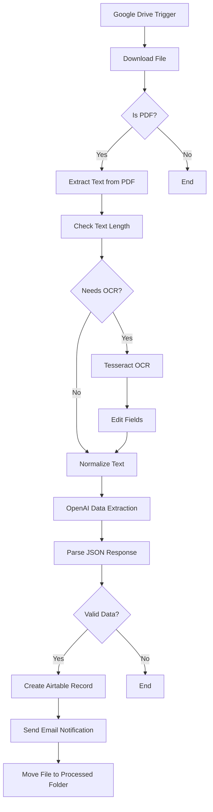

# Invoice Processor Automation

An intelligent invoice processing workflow that automatically extracts, structures, and manages invoice data from files using AI-powered text extraction and OCR technology.

## 🎯 Overview

This n8n workflow automates the entire invoice processing pipeline from file detection to data storage and team notification. It intelligently handles both text-based and image-based PDFs, ensuring accurate data extraction regardless of invoice format.

## ✨ Key Features

- **🔍 Smart File Detection**: Monitors Google Drive folder for new invoice
- **📄 Dual Text Extraction**: Uses both direct PDF text extraction and OCR for image-based invoices
- **🤖 AI-Powered Parsing**: Leverages OpenAI GPT-3.5-turbo for intelligent data extraction
- **📊 Structured Data Output**: Converts raw text into standardized JSON format
- **💾 Database Integration**: Automatically stores processed invoices in Airtable
- **📧 Team Notifications**: Sends formatted email alerts with invoice details
- **📁 File Management**: Moves processed invoices to organized folders

## 🏗️ Workflow Architecture



## 🚀 Getting Started

### Prerequisites

- **n8n Instance**: Self-hosted or n8n Cloud account
- **OpenAI API Key**: For AI-powered data extraction
- **Google Drive Access**: OAuth2 credentials for file monitoring
- **Airtable Account**: For invoice data storage
- **Gmail Account**: For email notifications

### Required Credentials

1. **Google Drive OAuth2 API**
   - Enable Google Drive API
   - Create OAuth2 credentials
   - Grant folder access permissions

2. **OpenAI API**
   - Generate API key from OpenAI platform
   - Ensure sufficient credits for GPT-3.5-turbo usage

3. **Airtable Personal Access Token**
   - Create personal access token
   - Grant access to invoice database

4. **Gmail OAuth2**
   - Enable Gmail API
   - Create OAuth2 credentials
   - Grant email sending permissions

## 📋 Setup Instructions

### Step 1: Import Workflow

1. Copy the `Invoice Processor.json` file
2. Import into your n8n instance
3. Activate the workflow

### Step 2: Configure Google Drive

1. **Create Folders**:
   - `New Invoice Folder`: Where new invoices are uploaded
   - `Processed Invoices`: Where processed files are moved

2. **Update Folder IDs**:
   - Replace folder IDs in the Google Drive Trigger node
   - Update the Move file node with your processed folder ID

### Step 3: Setup Airtable Database

Create an Airtable base with the following fields:

| Field Name | Type | Description |
|------------|------|-------------|
| `invoiceNumber` | Single line text | Invoice number/ID |
| `date` | Date | Invoice date |
| `Total` | Number | Total amount |
| `Vendor` | Single line text | Vendor/supplier name |

### Step 4: Configure Email Settings

1. Update the Gmail node with your email address
2. Customize the email template if needed
3. Test email delivery

### Step 5: Test the Workflow

1. Upload a sample invoice PDF to the monitored folder
2. Verify data extraction accuracy
3. Check Airtable record creation
4. Confirm email notification delivery

## 🔧 Configuration Details

### Google Drive Trigger Settings

- **Poll Frequency**: Every minute
- **Event Type**: File created
- **Folder**: Your designated invoice folder
- **File Filter**: PDF files only

### AI Data Extraction

The workflow uses OpenAI GPT-3.5-turbo with a specialized prompt to extract:

- **Invoice Number**: Handles various formats (Invoice, Invoice ID, Ref, Bill #)
- **Date**: Converts to YYYY-MM-DD format
- **Total Amount**: Extracts numeric value without currency symbols
- **Vendor Name**: Identifies supplier/company information

### Data Validation

The workflow includes validation checks to ensure:
- Invoice number is not empty
- Total amount is a valid number
- All required fields are present

## 📊 Output Format

### Airtable Record Structure

```json
{
  "invoiceNumber": "INV-2024-001",
  "date": "2024-01-15",
  "Total": 1250.00,
  "Vendor": "ABC Supply Company"
}
```

### Email Notification

The workflow sends a formatted HTML email containing:
- Invoice summary table
- Vendor information
- Invoice number and date
- Total amount
- Professional styling

## 🛠️ Customization Options

### Modify Data Extraction

1. **Update AI Prompt**: Edit the OpenAI node prompt for different field requirements
2. **Add New Fields**: Extend the Airtable schema and update field mappings
3. **Change Validation**: Modify the validation logic in the "If Valid?" node

### Email Customization

1. **Template Design**: Update the HTML email template
2. **Recipients**: Add multiple email addresses
3. **Subject Line**: Customize the email subject format

### File Management

1. **Folder Structure**: Organize processed files by date, vendor, or status
2. **File Naming**: Implement custom naming conventions
3. **Archive Strategy**: Set up long-term storage solutions

## 🔍 Troubleshooting

### Common Issues

**OCR Not Working**
- Ensure Tesseract node is properly configured
- Check if the PDF contains readable text
- Verify image quality and resolution

**Data Extraction Errors**
- Review OpenAI API key and credits
- Check the AI prompt for clarity
- Validate input text format

**Airtable Connection Issues**
- Verify personal access token permissions
- Check base and table IDs
- Ensure field names match exactly

**Email Delivery Problems**
- Confirm Gmail OAuth2 setup
- Check email address format
- Verify SMTP settings

### Debug Mode

Enable debug mode in n8n to:
- View data flow between nodes
- Identify processing bottlenecks
- Monitor API response times

## 📈 Performance Optimization

### Best Practices

1. **Batch Processing**: Process multiple invoices simultaneously
2. **Error Handling**: Implement retry logic for failed extractions
3. **Rate Limiting**: Respect API rate limits for OpenAI and other services
4. **Monitoring**: Set up alerts for workflow failures

### Scaling Considerations

- **High Volume**: Consider implementing queue management
- **Multiple Folders**: Duplicate workflow for different invoice types
- **Geographic Distribution**: Use region-specific API endpoints

## 🔒 Security Considerations

- **API Keys**: Store credentials securely in n8n
- **File Access**: Limit Google Drive permissions to necessary folders
- **Data Privacy**: Ensure compliance with data protection regulations
- **Audit Trail**: Maintain logs of processed invoices

## 📚 Related Workflows

- **Plumbing Voice Agent**: Voice-to-invoice automation
- **AI Customer Support**: Email processing and routing
- **AI Helpdesk**: Customer support automation

## 🤝 Support

For issues or questions:
1. Check the troubleshooting section
2. Review n8n community forums
3. Contact the workflow creator

## 📝 License

This workflow is part of the AI Automation Templates collection and is available under the MIT License.

---

*Last updated: January 2025*
